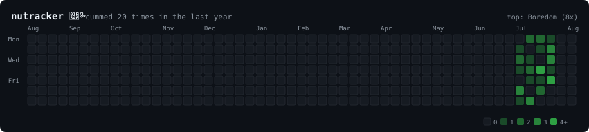

# Nutracker

> Educational purposes only.

A GitHub profile embed that generates a contribution heatmap tracking daily nuts. Built with GitHub Actions.



## How It Works

1. Edit `data.json` with your daily entries
2. GitHub Actions runs `generate-svg.js` on push/schedule
3. The SVG is updated in `output/tracker.svg`
4. Reference the SVG in your profile README

## Data Format

```json
{
  "2026-07-26": { "did_it": true, "for_what": "zero_two", "times": 2 },
  "2026-07-25": { "did_it": false, "for_what": null, "times": 0 }
}
```

### Fields

- `did_it` - `true` if you nutted, `false` if you skipped
- `for_what` - what you nutted to (any `snake_case` string)
- `times` - how many times (determines heatmap darkness: 0=gray, 1=light, 2=medium, 3=dark, 4+=darkest)

### Examples for `for_what`

- `for_fun`
- `hentai`
- `porn`
- `boredom`
- `loneliness`
- `your_waifu`
- `anything`

## Usage in Profile README

```markdown

```

## Manual Generation

```bash
node generate-svg.js
```

## GitHub Actions

The workflow runs:
- On push to `main`
- Daily at midnight UTC
- Manually via `workflow_dispatch`

## License

MIT - Because why not.
